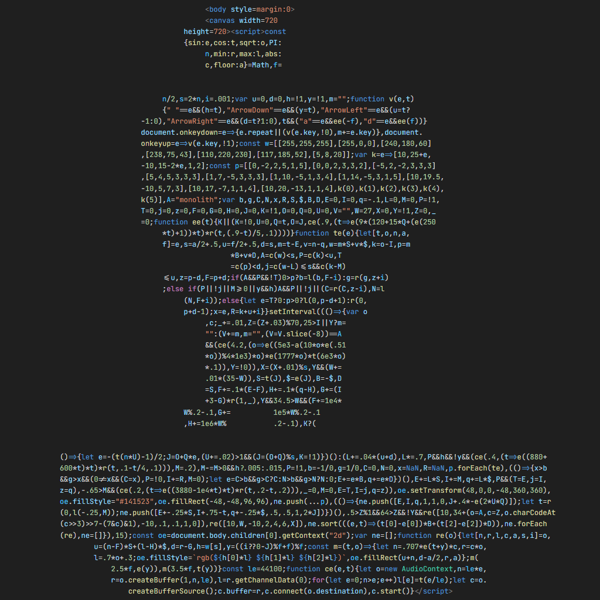
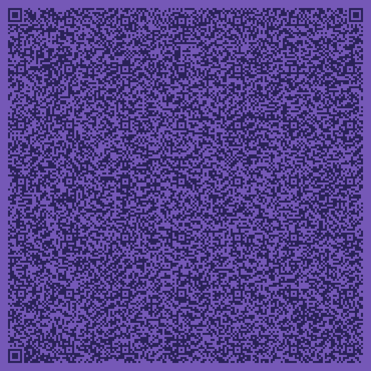

# fz3kb

This repository contains project files of fz3kb - a self-contained FEZ-like HTML5 game which fits within 3 kilobytes (2939 bytes). The project has been created for [FEZ Creative Jam](https://itch.io/jam/fez).

## Features
- Rudimentary 2.5D box rendering.
- Unreasonably solid FEZ-like controller and collision system.
- Procedurally generated sound effects.
- A single level serving a small platforming challenge.
- A pyramid in a sky with *a mysterious secret hidden within it... 🤔*
- Ability to be distributed with a QR code

